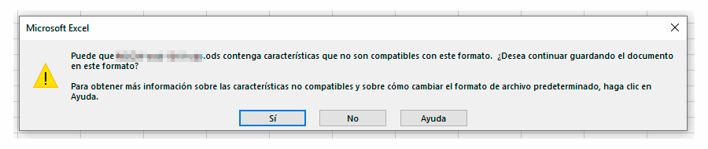

Excel 365 (como casi todas las aplicaciones de Office 365, supongo; al menos Word y PowerPoint) dice [poder manejar archivos en formato OpenDocument](https://support.office.com/es-es/article/Usar-Excel-para-abrir-o-guardar-una-hoja-de-c%C3%A1lculo-con-el-formato-Hoja-de-c%C3%A1lculo-de-OpenDocument-ods-C7114BAA-F08A-49EB-AEFD-F5D61ED347CD) (`.ods`), lo cual es interesante no solamente porque permite trabajar con formatos abiertos, sino porque además esto abre la puerta a utilizar los archivos con otras aplicaciones (como LibreOffice/OpenOffice Calc) y a poder acceder a los datos de otras maneras<!--more-->^[Tuve una experiencia horrible en la que los formatos condicionales de una hoja de cálculo se cargaron completamente el archivo y no había manera humana de recuperarlo... la única forma de acceder al contenido fue gracias a que el formato del archivo era .ods y lo pude descomprimir para modificar donde hizo falta y al menos recuperar los datos.].

Esta versión de Excel además no lo hace mal (a diferencia de lo que recuerdo de versiones anteriores), al menos si no tienen fórmulas demasiado complejas. Lo que sí hace, sin embargo, en una reminiscencia del malogrado [Clipo](https://es.wikipedia.org/wiki/Ayudante_de_Office), es recordarte **cada vez que guardas una hoja de cálculo en formato `.ods`** que, OJOCUIDAO, te estás inclinando hacia el lado oscuro con eso de utilizar formatos _raros_ y a ver si vas a acabar perdiendo datos, porque ai, probablemente no sabes lo que haces.

Si no es el caso o eres de las que te ríes en la cara del peligro, puede que prefieras simplemente _desactivar_ esa notificación. 

No existe ninguna forma prevista en la interfaz de Excel que esté documentada o al menos que haya sido capaz de encontrar, pero afortunadamente he conseguido topar con [un artículo de soporte oficial de Microsoft](https://support.microsoft.com/en-us/help/970020/how-to-suppress-or-display-a-warning-message-when-users-try-to-save-a) que explica cómo hacerlo mediante una modificación en el registro de Windows. Paso a paso:

1. Accede al editor del registro de Windows: clic en <i class="fab fa-windows"></i> y empieza a escribir `registro...`. Debería aparecer "Editor del Registro" en el menú de Inicio. Clic en "Sí" a la confirmación para permitir a la aplicación realizar cambios en el equipo.
2. Accede en la barra lateral izquierda a la opción `HKEY_CURRENT_USER` > `Software` > `Microsoft` > `Office` > `16.0` > `Excel` > `Options`, y añade un nuevo `Valor de DWORD (32 bits)` con estas características:
    - Nombre del valor `DisableSaveAsLossWarningOpenDocumentSpreadsheet`
    - Información del valor: 0 (mostrar la notificación) o 1 (ocultar la notificación)

¡Listo! La notificación no vuelve a aparecer al guardar una hoja de cálculo en formato `.ods` con Excel. 

Aparentemente, este problema puede surgir también al utilizar formatos OpenDocument en Word o en PowerPoint; la manera de resolverlo es la misma, pero accediendo a la opción correspondiente en el registro (`Word` o `PowerPoint` en lugar de `Excel`), y configurando los valores `DisableSaveAsLossWarningOpenDocumentText` o `DisableSaveAsLossWarningOpenDocumentPresentation` respectivamente.
