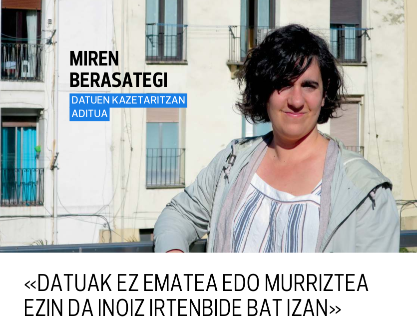
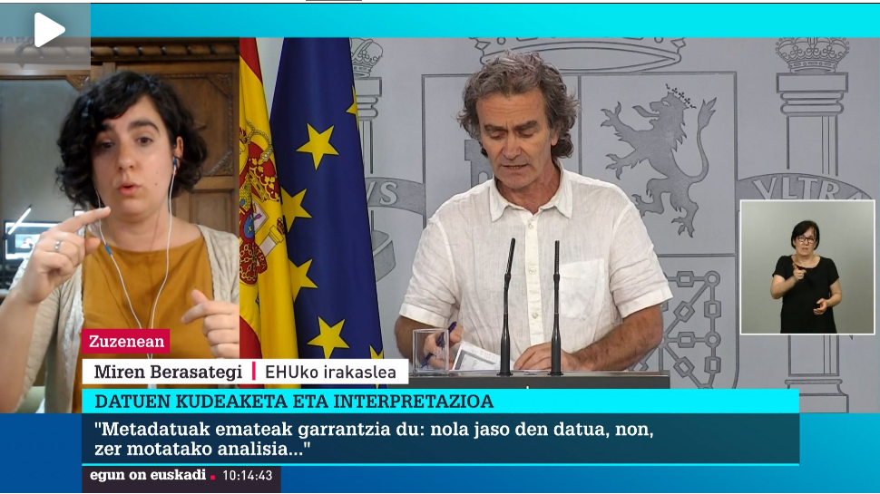

COVID-19aren datuen argitalpena eta erabileraren harira, hainbat hedabideetatik deitu naute azken asteetan elkarrizketak egiteko.<!--more-->

**Irutxuloko Hitza**n, ["Datuak ez ematea edo murriztea ezin da inoiz irtenbide bat izan"](https://irutxulo.hitza.eus/2020/05/22/datuak-ez-ematea-edo-murriztea-ezin-da-inoiz-irtenbide-bat-izan/
). [**Argia**n ere](https://www.argia.eus/albistea/datuak-ez-ematea-edo-murriztea-ezin-da-inoiz-irtenbide-bat-izan
) argitaratua.

<!--  -->

**ETB1**en, [ekainaren 1eko _Egun on Euskadi_ saioan](https://www.eitb.eus/eu/telebista/programak/egunon-euskadi/bideoak/osoa/7272742/bideoa-miren-berasategi-deustuko-irakaslea-koronabirusaren-datuen-inguruan/
).

**Euskadi Irratia**n, [ekainaren 9ko _Baipasa_ saioan](https://www.eitb.tv/eu/irratia/euskadi-irratia/baipasa/6903042/7292146/baipasa-2020-06-09) (1h15min-tik aurrera).

    <iframe scrolling="no" src="https://www.eitb.eus/eu/get/multimedia/screen/id/7292146/tipo/audio/euskadi-irratia/" frameborder="0" marginwidth="0" marginheight="0" scrolling="no" style="position: absolute;top:0;left: 0;width: 350px;height:100%;" ></iframe>

