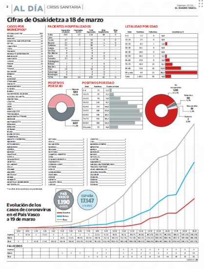

# Datos COVID y   ansiedad matemática:  un círculo vicioso

Miren Berasategi

---

<figure><figcaption>El Diario Vasco, 17 enero 2020</figcaption></figure>

---

<figure><figcaption>El Diario Vasco, 14 marzo 2020</figcaption></figure>

---

<figure><figcaption>El Diario Vasco, 16 marzo 2020</figcaption></figure>

---

<figure><figcaption>El Diario Vasco, 20 marzo 2020</figcaption></figure>

---

<figure><figcaption>El Diario Vasco, 27 marzo 2020</figcaption></figure>

---

<figure><figcaption>El Diario Vasco, 30 abril 2020</figcaption></figure>

---

«reacción afectiva negativa» (Ashcraft y Moore, 2009, p. 197) 

«**tensión</strong> y <strong>ansiedad**» (Richardson y Suinn, 1972, p. 551)

«**miedo</strong> al fracaso o a la equivocación» (Perry, citado en Baus y Welch, 2008)

«**miedo</strong> y <strong>pavor**» (Lewis, citado en Hembree, 1990) 

«**pavor</strong> patológico y humildad flagrante [<em>helplessness</em>]» (Guillen, 1983, p. 2)

«**pánico**, <strong>indefensión**, <strong>parálisis</strong> y <strong>desorganización</strong> mental» (Hunt, citado en Deieso y Fraser, 2018)

«esta emoción es desagradable, está orientada al futuro, y es <strong>completamente desproporcionada</strong> con respecto a la amenaza» (Hembree, 1990, p. 33)

---

<figure><figcaption markdown="1">Agencia SINC (2020), obtenido de [WikiMedia](https://commons.wikimedia.org/wiki/File:Covid-19-curves-graphic-social-v3-es.gif)</figcaption></figure>

---

## Referencias

Agencia SINC (2020). <a href="https://www.agenciasinc.es/Noticias/Las-dos-graficas-que-explican-como-podemos-frenar-la-epidemia-de-COVID-19">Las dos gráficas que explican cómo podemos frenar la epidemia de COVID-19</a>

Ashcraft, M. H., & Moore, A. M. (2009). Mathematics Anxiety and the Affective Drop in Performance. _Journal of Psychoeducational Assessment_, 27(3), 197–205. `https://doi.org/10.1177/0734282908330580`

Baus, R. D., & Welch, S. A. (2008). Communication Students’ Mathematics Anxiety: Implications for Research Methods Instruction. _Communication Research Reports_, 25(4), 289–299. `https://doi.org/10.1080/08824090802440196`

Deieso, D., & Fraser, B. J. (2018). Mathematics Anxiety: Its Assessment, Determinants and Remedies. En R. V. Nata (Arg.), _Progress in Education_. Volume 52 (or. 113–137). Nova Science Publishers.

Guillen, M. (1983). _Bridges to infinity: The human side of mathematics_. Jeremy P. Tarcher. <a href="https://archive.org/details/bridgestoinfinit00guil">https://archive.org/details/bridgestoinfinit00guil</a>

Hembree, R. (1990). The Nature, Effects, and Relief of Mathematics Anxiety. _Journal for Research in Mathematics Education_, 21(1), 33–46. `https://doi.org/10.2307/749455`

Richardson, F. C., & Suinn, R. M. (1972). _The Mathematics Anxiety Rating Scale: Psychometric data. Journal of Counseling Psychology_, 19(6), 551–554.

