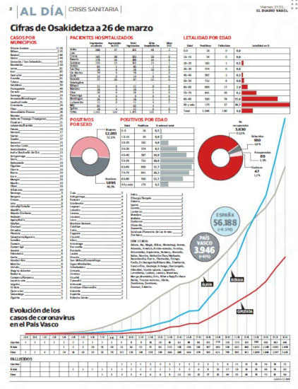

# Datos COVID y   ansiedad matemática:  un círculo vicioso

Miren Berasategi

---

<figure><figcaption>El Diario Vasco, 17 enero 2020</figcaption></figure>

---

<figure><figcaption>El Diario Vasco, 14 marzo 2020</figcaption></figure>

---

<figure><figcaption>El Diario Vasco, 16 marzo 2020</figcaption></figure>

---

<figure><figcaption>El Diario Vasco, 20 marzo 2020</figcaption></figure>

---

<figure><figcaption>El Diario Vasco, 27 marzo 2020</figcaption></figure>

---

<figure><figcaption>El Diario Vasco, 30 abril 2020</figcaption></figure>

---

«reacción afectiva negativa» (Ashcraft y Moore, 2009, p. 197) 

«tensión y ansiedad» (Richardson y Suinn, 1972, p. 551)

«miedo al fracaso o a la equivocación» (Perry, citado en Baus y Welch, 2008)

«miedo y pavor» (Lewis, citado en Hembree, 1990) 

«pavor patológico y humildad flagrante \(_helplessness:\)» (Guillen, 1983, p. 2)

«pánico, indefensión, parálisis y desorganización mental» (Hunt, citado en Deieso y Fraser, 2018)

«esta emoción es desagradable, está orientada al futuro, y es completamente desproporcionada con respecto a la amenaza» (Hembree, 1990, p. 33)